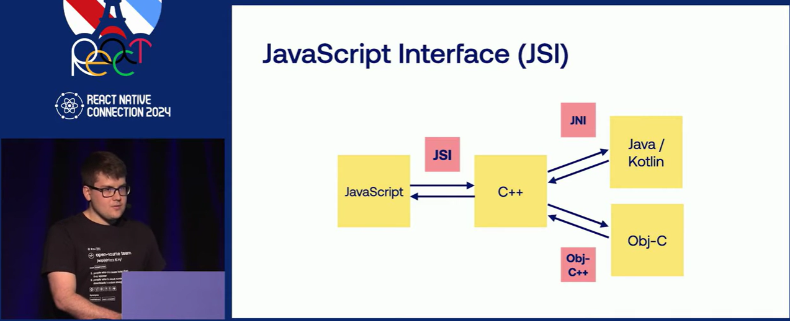
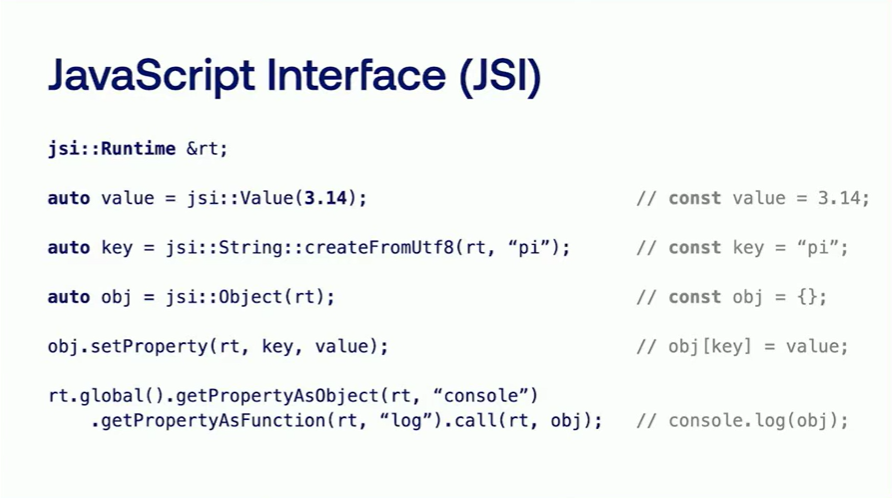

# New Architecture


< Old Archtecture >


< New Architecture >

출처 : [Sanjana Human의 블로그](https://sanjanahumanintech.medium.com/react-native-new-fabric-architecture-introduced-4f208c256d67)

--- 

간단 설명 : https://www.youtube.com/live/0ckOUBiuxVY?feature=shared&t=3117

핵심을 요약하면 다음과 같다. 기존의 Old Architecture에서 JS와 네이티브간의 통신은 JSON을 직렬화, 역직렬화 하는 `메시지 패싱` 방식을 사용하였다. `메시지 패싱`을 사용한 이유는 JS와 네이티브 간에 메모리 공유가 되지 않았기 때문이고 이는 명백히 오버헤드를 가져왔으며 새로운 아키텍처는 이러한 오버헤드의 제거를 목표로 한다. 

이것을 가능하게 하는 방법은 JS와 네이티브 간에 메모리를 공유하는 것인데 이를 가능하게 하는 기술을 JSI(Javascript Interface)라고 한다.



출처 : React Native Connection 2024 - Tomasz Zawadzki - New Architecture is here
 (https://www.youtube.com/watch?v=jf0WTF4z8O0)

결국 JS와 네이티브간에 공유되는 메모리는 C++기반의 JSI 코드이며 이전의 Bridge대비 오버헤드는 훨씬 줄어들었지만 오버헤드가 0은 아니다. 그러므로 JSI 호출을 줄이는 것이  퍼포먼스에 도움이 될 수 있다.

아래는 C++로 작성된 JSI의 코드이다


출처 : https://www.youtube.com/watch?v=jf0WTF4z8O0

JS에서 안드로이드의 네이티브 함수를 호출하는 시나리오를 가정해보자. JS 스레드에서 JSI를 호출하고, 그 JSI내부에서 JNI(Java Native Interface)를 경유하여 안드로이드 네이티브 SDK를 호출한다. 이 모든 과정은 동기적으로 일어난다. 즉 비동기 기반의 Old Architecture에서는 작업이 완료되면 테스트가 이벤트루프의 큐(Queue)에 등록이 되어서 즉각적으로 실행되지 않을 때도 있었지만 동기 방식은 큐(Queue) 대기열에서 기다릴 필요가 없어 즉각 실행된다.

---

## Fabric : 렌더링 엔진

Fabric은 뉴 아키텍처에 추가된 새로운 렌더링 엔진이다. JS와 네이티브 간의 데이터 패싱이 동기적으로 진행되는 이점을 렌더링에 적용한 것이 Fabric 엔진의 핵심이다. 

즉 비동기 처리는 단순히 속도가 느리다는 차원을 넘어서 JS와 네이티브 UI간의 프레임 동기화가 되지 않는다는 치명적인 결함이 있다. 이와 관련하여 `useLayoutEffect` 함수의 예시를 들 수 있는데, 이 함수는 본래 레이아웃 페인팅 직전에 호출되지만 JS와 네이티브간의 비동기 통신 환경에서는 네이티브 UI에 페인팅되기 직전의 타이밍을 정확히 캐치할 수 없다.

정리하면 네이티브 UI측의 렌더링 라이프사이클을 JS에서 탐지하기 어려운게 비동기 통신 환경이고 통신방식이 동기로 변경되면서 렌더링 라이프사이클을 동기화하는 것이 어느정도 가능해졌다. Fabric 엔진 기반에서는 `useLayoutEffect` 함수가 의도한 타이밍에 정확히 호출된다.

JS와 네이티브간의 통신이 동기 방식으로 변경되면서 코드도 한층 더 간결해졌다. 기존의 코드는 JS에서 함수를 호출한 뒤에 네이티브 UI에서 응답하는 결과를 콜백 방식으로 처리하였지만 이제 일부 함수에서는 아래와 같이 직관적으로 호출할 수 있다
```js
 const responseFromNativeUI = someNativeAPICall()
```

하지만 Fabric 엔진도 완벽하지 않다. `useLayoutEffect` 이 호출되는 상황은 JS에서 UI를 commit하여 네이티브 UI에 렌더링하는 프로세스로 진행되어 제어권이 JS에 있으므로 리액트의 라이프사이클 함수가 정확한 타이밍에 정상 수행될 수 있지만 그렇지 않은 경우를 생각해보자. 즉 네이티브 UI에서 이용자가 스크롤을 하거나 UI 애니메이션이 실행되는 경우, 프레임 단위로 JS의 리액트와 라이프사이클을 공유한다는 것은 사실상 불가능에 가깝다. 

이 문제를 해결하는 방법은 네이티브 UI 스레드에서 직접 자바스크립트 코드를 실행하는 방법 뿐이다. 즉 경량 JS엔진을 네이티브 UI 스레드에 로드하여 JS로직을 네이티브 UI 스케줄러에 편입시키는 것인데 이렇게 하면 네이티브 UI의 라이프사이클과 완벽한 동기화가 가능해진다. 이런 방식을 채택한 대표적인 라이브러리로 `react-native-reanimated (version 3)`가 있다. 이 코드의 코어부분은 C++로 작성되어 있고 `useAnimatedStyle` 등의 핵심 함수가 worklet이라는 형태로 네이티브 UI스레드에서 실행된다. Worklet의 상세 설명은 [여기](https://docs.swmansion.com/react-native-reanimated/docs/guides/worklets/)를 참조할 것

이 Worklet은 JS엔진인 Hermes의 인스턴스를 생성하는데 `WorkletHermesRuntime` 클래스가 JSI의 서브클래스이므로 실제로는 네이티브 UI 스레드에서 JSI 인스턴스를 생성한다. 그리고 JSI 인스턴스가 헤르메스 런타임 인스턴스를 컨트롤한다

>  WorkletHermesRuntime Class is in fact a subclass of jsi::Runtime. WithRuntimeDecorator is a
 template class that is a subclass of DecoratedRuntime which is also a
 template class that then inherits its template, which in this case is
 jsi::Runtime. So the inheritance is: WorkletHermesRuntime ->
 WithRuntimeDecorator -> DecoratedRuntime -> jsi::Runtime You can find out
 more about this in ReactCommon/jsi/jsi/Decorator.h or by following this link:

상세 코드는 [여기](https://github.com/software-mansion/react-native-reanimated/blob/f28b5ef18a71fe59012de5f4492f0bf784ba4798/packages/react-native-worklets/Common/cpp/worklets/WorkletRuntime/WorkletHermesRuntime.h#L108)를 참조

네이티브 UI스레드에서 실행되는 JSI 인스턴스는 오로지 UI 애니메이션 로직만 처리하며 해당 JSI에서는 리액트가 실행되지 않는다. 즉 리액트 라이프사이클과는 무관하게 처리되므로 네이티브 UI의 라이프사이클과 완전하게 통합될 수 있다

매 프레임마다 호출되는 `useAnimatedStyle`의 예를 들면, 이 함수는 매 프레임마다 네이티브 UI스레드의 스케줄러에 의해 호출되어야 한다. 웹개발에 익숙한 개발자라면 매 프레임마다 호출되는 `requestAnimationFrame` 함수가 익숙할 텐데, 안드로이드에도 이와 유사한 API인  [Choreographer API](https://developer.android.com/reference/android/view/Choreographer) 가 존재한다. `useAnimatedStyle`은 매 프레임마다 Choreographer API를 호출하여 렌더링 작업을 예약하기 때문에 네이티브 UI 프레임과 완전한 동기화가 가능해지는 것이다. 상세 코드는 [여기](https://github.com/software-mansion/react-native-reanimated/blob/f28b5ef18a71fe59012de5f4492f0bf784ba4798/packages/react-native-worklets/android/src/main/java/com/swmansion/worklets/runloop/AnimationFrameQueue.java#L11) 를 참조

## Yoga : 레이아웃 계산 엔진

네이티브 UI의 어느 부분에 컴포넌트를 렌더링할지 위치와 크기를 계산하는 엔진이다. 이 엔진은 C++로 작성되었으며 JS와 네이티브간에 메모리 공유 지점에서 실행된다. CSS Flexbox와 같은 레이아웃 시스템으로 UI 배치를 담당한다


## Static Hermes : 네이티브 컴파일을 가능하게 하는 차세대 JS엔진 (현재 개발중)

Static Hermes는 `New Architecture`에 속하는 개념은 아니지만 매우 중요한 개념이라 소개한다. 

Static Hermes는 더 빠른 실행속도를 목표로 고안된 JS엔진이며 빌드 타임에 자바스크립트 코드를 네이티브 코드로 컴파일한다. 즉 디바이스가 해당 코드를 즉시 실행할 수 있기 때문에 Hermes나 V8같은 JS 런타임이 필요 없어진다.

Static Hermes의 상세 내용에 대해서는 [여기](https://www.youtube.com/watch?v=GUM64b-gAGg) 를 참조할 것